# Machine Learning Engineer Nanodegree
## Capstone Project
Mohammed Ashour  
Jan 28th, 2020

## I. Definition

### Project Overview
Emotions are one of the most obvious and important factors to understand humans. Expressing our ideas is made very easier using emotions.

In this project, I'll try to make an emotion intelligent model that can understand human emotions from the facial expressions in images.

By understanding the current emotions of a person we can do ALOT. for example, we can detect the driver situation/state in a car and using this information to reduce car accidents, we can use it in media research,...etc

This topic is very active in research, I'm trying to do my best here to make a well-established contribution as reaching for a good model that can extract the most important features in the images and make a good judgment using the available data.

One of the aspiring companies in this field is affectiva, they had a set of products that using emotions recognition to empower automotive solutions and media research.

In this project I trained and tested multiple Deep Neural network on the FER2013 dataset to get the best I can as Facial Emotion Detection and recognition Model

### Problem Statement
e main objective of this project is classifying human emotions using their facial expressions.
Using this solution we can do better AI robotics, more intelligent self-driving cars agents and better media research.
The images are in gray-scale and jpg format, we will have a training and testing set. 
we will have different emotions included in our dataset like

Angry, Disgust, Fear, Happy, Sad,  Surprise, Neutral

and the goal of our model is to try to differentiate between them.
This is a multi-class classification problem with more than 2 classes.
The emotion that will get the most scores of them will determine the model estimation of the image.

Using FER2013 (that was originally presented on kaggle) we got more than 12000 example of 48*48 images of people faces with emotion labels describes what emotion they represent. With this data We can build a small system that can detect the state of the person using his Facial Expressions

### Metrics
For Evaluation,I used the Traditional Accuracy score.
Using the Traditional Accuracy score gives us initial intuition about how many misses our makes with it's guesses. 
As I Tested 3 different Models each with it's own different construction , I calculated the score of each one in both 
- test accuracy
- validation accuracy

In all the models I tested I used categorical cross entropy as a loss function, it goes like this

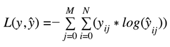

As here we have a classification problem, there is only one single label is applicable for each data point(image)

## II. Analysis

### Data Exploration
As we discussed Earlier, our dataset consists of gray-scale images with resolution 48*48 pixels that are classified in  these categories
0: Angry

1: Disgust

2: Fear

3: Happy

4: Sad

5: Surprise

6: Neutral

### Exploratory Visualization

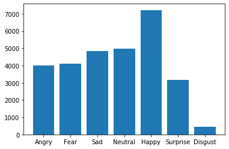

 as we see in the chart, the images are as follow

Happy =    7215

Neutral =   4965

Sad =   4830

Fear =    4097

Angry =    3995

Surprise =    3171

Disgust =     436

The dataset split in 3 chuncks
- Training (the bigger one)
- Validation 
- and Testing_

### Algorithms and Techniques
The proposed solution to this problem is to use a deep learning model that can extract complex features from images, like CNNs.

First I made a 18 layer CNN with maxpool and dropout of .25

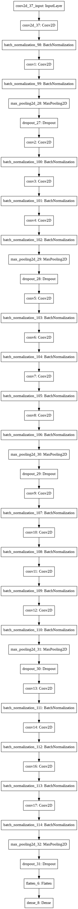

I managed to get 60% validation accuracy from only 50 epochs

I also  used th vgg16 pre-trained model, and surprisely I got worse results!

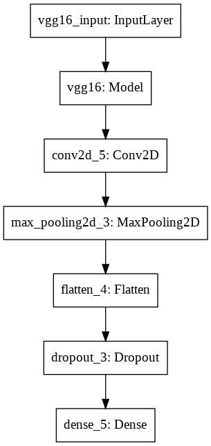

Finally I tried a simple small CNN to see if it can do better, I thought that maybe If I had less parameters to train it could make it easier for the model to understand the data better

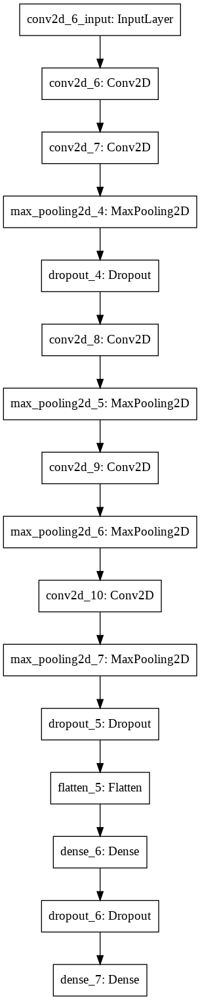

### Benchmark
In the simple CNN model we was able to get 60% accuracy score from 100 epochs.

Considering the simple small CNN as an estimator to how good or bad other models did, we will have:
- The 18 layer CNN did a lot better, with only 50 epochs (half the epochs used in the other models) I was able to get a 60% accuracy which is promising

- The Vgg16 model did poorly as it only got 40% accuracy with 100 epochs

## III. Methodology

### Data Preprocessing
The Image data is stored as rows of pixel values in the csv file, so it needed some preprocessing steps 
- First, got the string row and convert it to a matrix of numbers
- Second, convert the matrix from the normal shape to the 48*48 shape
- Third, as for the Vgg16 network, it requires the images in 3 channels, so reshaping the images was needed to make it go in 48 * 48 * 3

### Implementation
I used several tools in building this project 
* Keras (with tensorflow as backend)
* numpy (for all the data processing)
* pandas (for data loading and processing)
* matplotlib (for data visualization)
I planned at first to use `pytorch`, but After I tried Keras I found it more easier and effective than using vanilla Pytorch, and the performance was about the same.

## IV. Results

### Model Evaluation and Validation
First I made a 18 layer CNN with maxpool and dropout of .25
and using this structure I got some good results

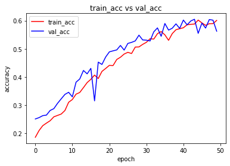
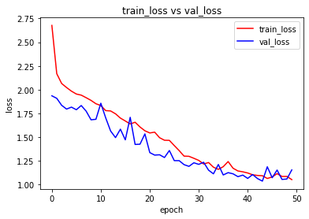

I managed to get 60% validation accuracy from only 50 epochs
I also  used th vgg16 pre-trained model, and surprisely I got worse results!
I managed to only get 40% in the validation accuracy for 100 epochs

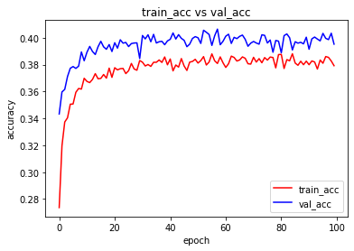
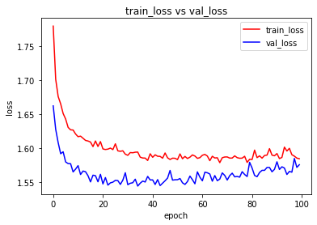

Finally I tried a simple small CNN to see if it can do better, I thought that maybe If I had less parameters to train it could make it easier for the model to understand the data better
I got 60% out of 100 epochs.

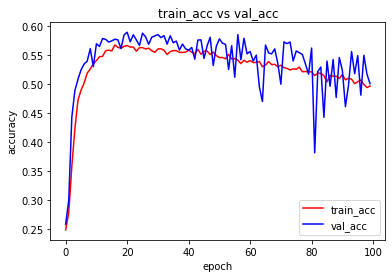
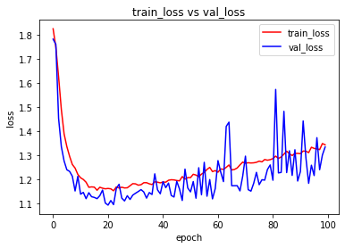

### Justification

As the 18 layer CNN was better in results and faster in the learning process, I choose to use it as it's smaller than the Vgg16 network and simpler in construction.

I expect to get better result from this model when I increase the number of epochs and get more data(also make it more balanced)

Ass I mentioned before, I got 60% for validation accuracy using this model for 50 epochs.

### References
This is some references That I may use in my project

- Dataset kaggle : https://www.kaggle.com/c/challenges-in-representation-learning-facial-expression-recognition-challenge/data 

