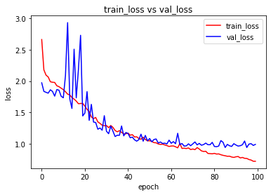
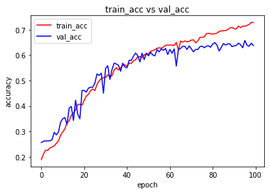
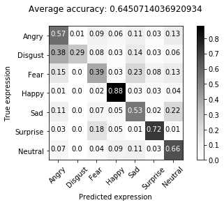

# Face Exepression Recognition-Capstone

My capstone project for Udacity's Machine Learning Nanodegree

**Topic:** 
FER2013 Model for Facial Exepression recognition
## Dataset

The training and testing datasets can be downloaded from [Kaggle's competition webpage](https://www.kaggle.com/c/challenges-in-representation-learning-facial-expression-recognition-challenge/data).

Note: The notebook assumes data files are stored in `./data/` directory.

The final loss and accuracy score the model (conv5_model) managed to get after 100 epochs of learning

Loss

Accuracy

## Requirements

* Python >= 3.6
* numpy >= 1.14.3
* pandas >= 0.23.0
* scikit-learn >= 0.19.1
* keras

